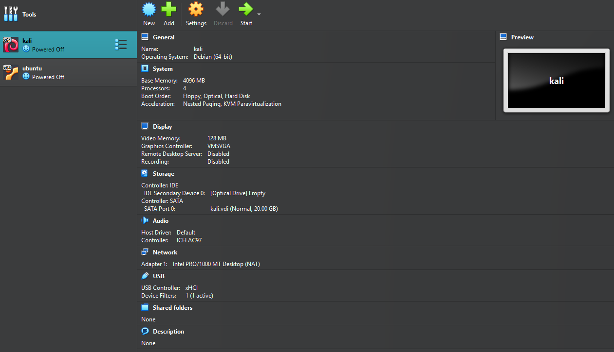
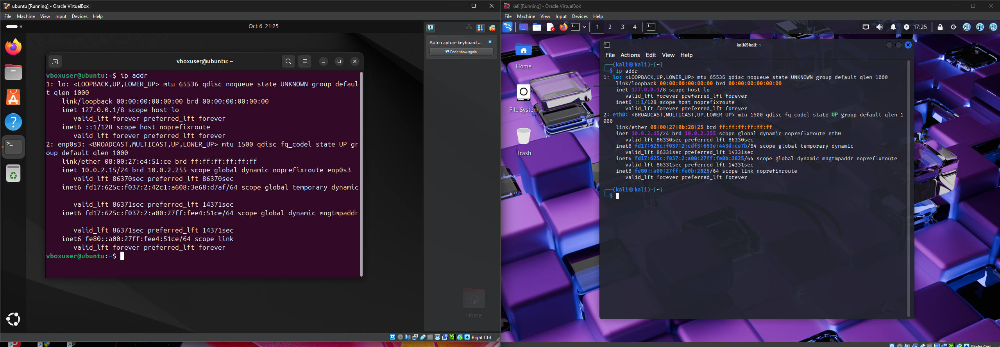
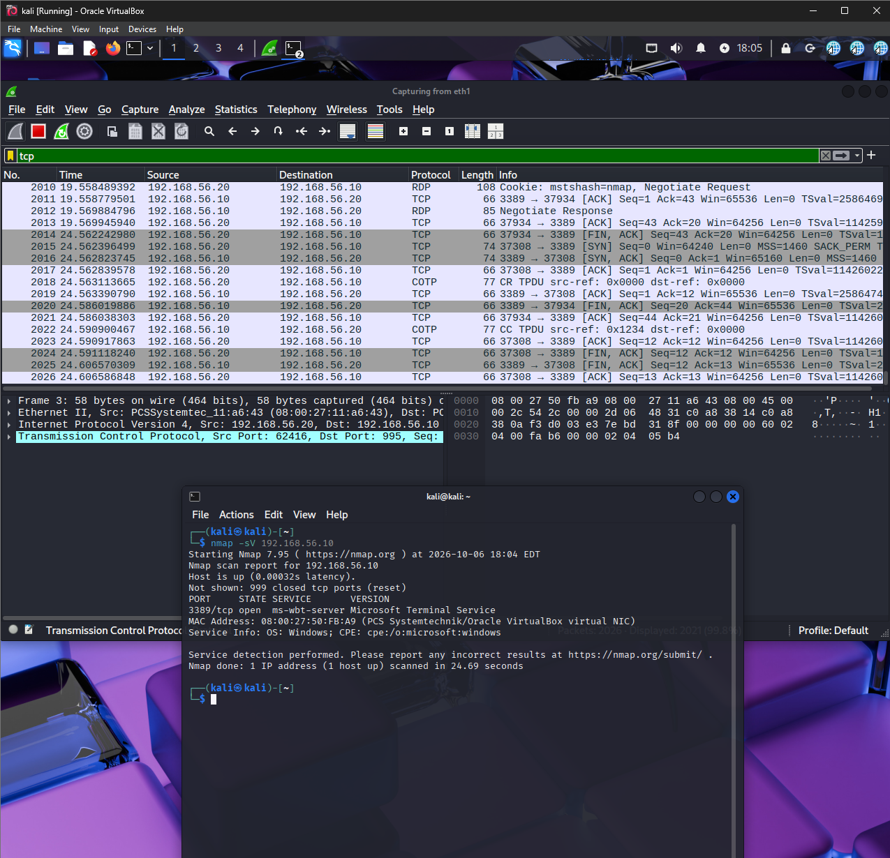
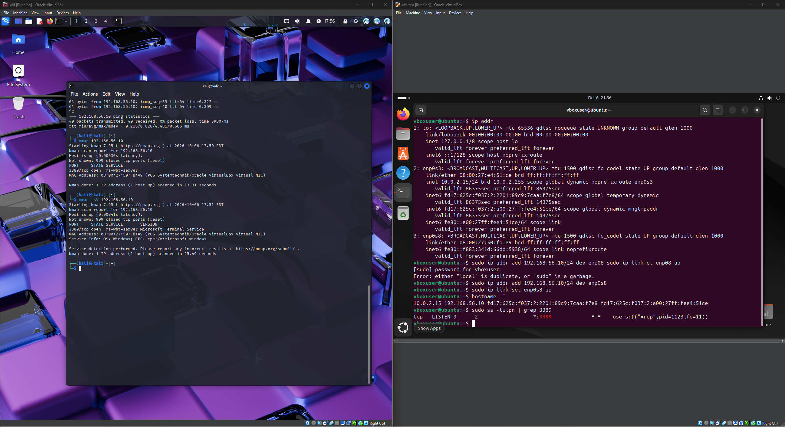
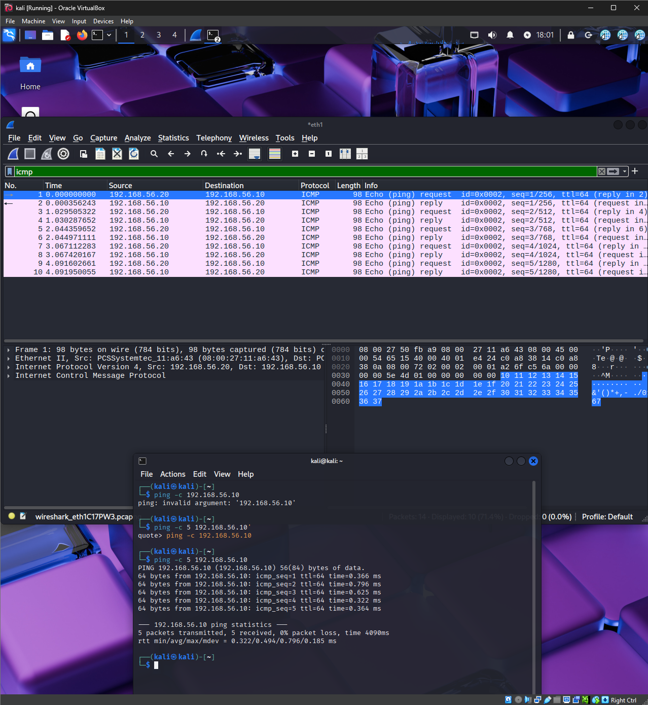

# Cybersecurity Home Lab

This project documents my personal cybersecurity home lab built to practice networking, Linux, virtualization, and basic security concepts.

## Lab Environment
- Oracle VirtualBox
- Kali Linux
- Ubuntu Linux
- Windows
- Nmap
- Wireshark

## What I Practiced
- Creating and configuring virtual machines
- Linux command-line basics
- Network scanning with Nmap
- Identifying open ports and network services
- Capturing and analyzing network traffic with Wireshark
- Basic network troubleshooting
- Cybersecurity reconnaissance concepts

## Nmap
I used Nmap inside my virtual lab to scan systems and identify open ports and available network services.

## Wireshark
I used Wireshark to capture network packets and examine traffic between systems in my lab.

## Purpose
The purpose of this lab is to develop hands-on cybersecurity and networking skills while learning how common security tools work in a controlled environment.

## Disclaimer
All security testing was performed on systems inside my own isolated virtual lab for educational purposes.

## Lab Screenshots

### Virtual Lab Setup
I created an isolated virtual lab using Oracle VirtualBox with Kali Linux and Ubuntu.

### Kali and Ubuntu Networking
I configured a private lab network between Kali Linux and Ubuntu for testing and traffic analysis.

### Nmap and Wireshark Analysis
I used Nmap to scan the Ubuntu system and Wireshark to capture and analyze the resulting network traffic.

### Ubuntu Service Verification
Nmap identified port 3389 as an RDP service. I verified on Ubuntu that the port was being used by the `xrdp` service.

### ICMP Traffic Analysis
I captured ICMP echo requests and replies between Kali Linux and Ubuntu using Wireshark.

